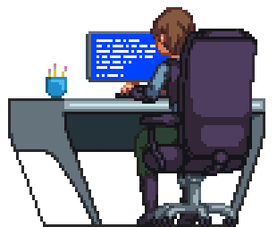

<h1 align="center">Hi 👋, I'm Assem</h1>
<h3 align="center">Software Engineer | Full Stack Developer | Frontend & Backend Engineer | React.js & Node.js Developer | Robotics coach, Programming & Web instructor.</h3>

     
-  I’m currently working as a **Software Engineer**

-  I’m currently learning **RAG, LLM, Automation**

-  Ask me about **Software Engineer, React Js, Next Js, Node Js, Python**

-  I’m eager to collaborate with **Creative Minds & Talented Developers**

<h1>Let's Connect!</h1>

<table align="center" class="table table-dark">
  <tr bg-dark>
    <td align="center" widht=90>
        
       Linkedin
    </td>
   <td align="center" widht=90>
        
         Gmail
    </td>
  </tr>
</table>

<h1>💻 Tools & Technology:</h1>

<table align="center" class="table table-dark">
  <tr bg-dark>
   <td align="center" widht="90">
      
       HTML
    </td>
    <td align="center" widht="90">
      
       Javascript
    </td>
    <td align="center" width="90">
      
       Typescript
    </td>
    <td align="center" widht="90">
      
       React Js
    </td>
    <td align="center" width="90">
      
       Next Js
    </td>
    <td align="center" width="90">
      
       Bootstrap
    </td>
    <td align="center" width="90">
      
       TailwindCSS
    </td>
   <td align="center" widht="90">
      
       NodeJs
    </td>
   <td align="center" widht="90">
      
       Express
    </td>
  </tr>
  <tr>
     <td align="center" widht=90>
      
       MongoDB
     </td>
     <td align="center" widht=90>
      
       C++
     </td>
     <td align="center" width="90">
      
       Arduino
    </td>
    <td align="center" width="90">
      
       Raspberry Pi
    </td>
    <td align="center" width="90">
      
       Python
    </td>
    <td align="center" widht=90>
      
       Docker
    </td>
    <td align="center" width="90">
      
       Actions
    </td>
    <td align="center" width="90">
      
       TensorFlow
    </td>
    <td align="center" width="90">
      
       Git
    </td>
  </tr>
</table>

<h1>📊 GitHub Stats:</h1>

  

